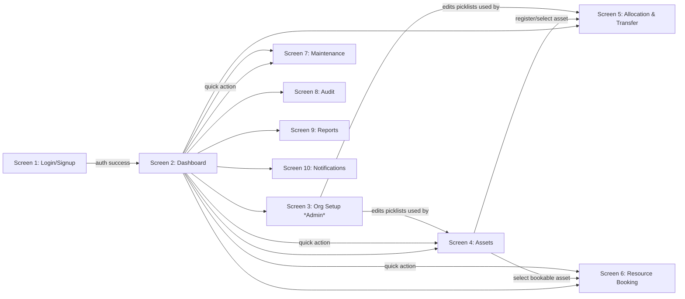
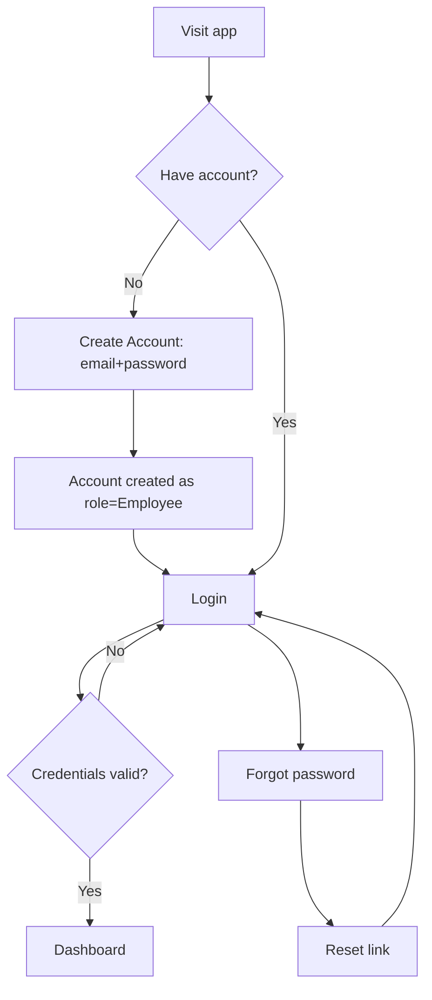
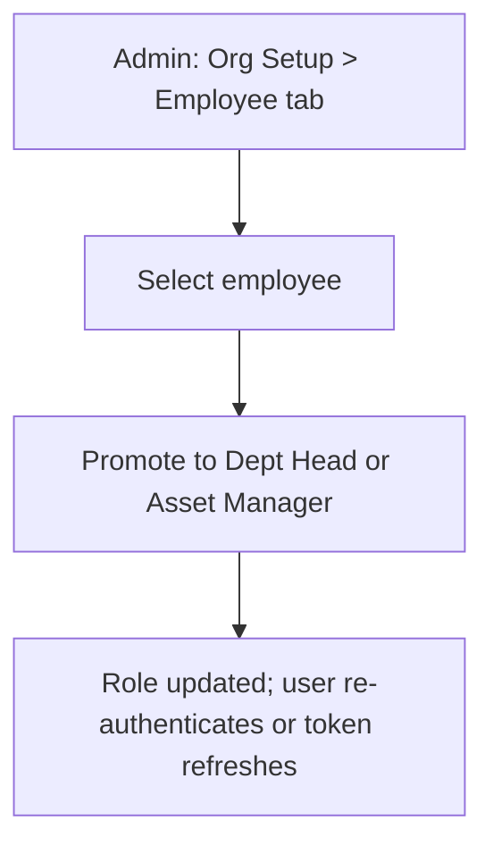
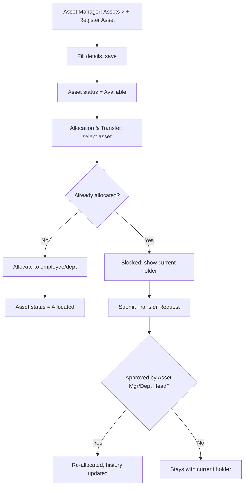
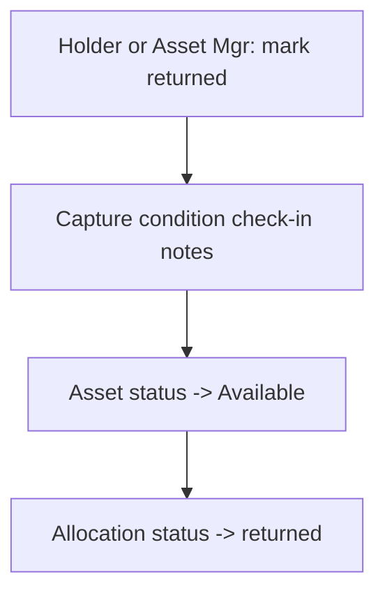
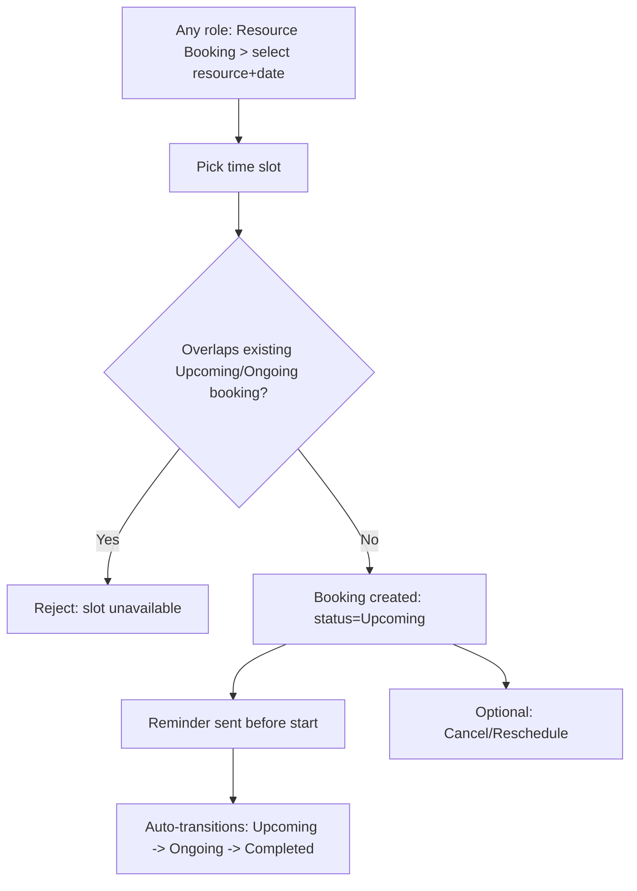
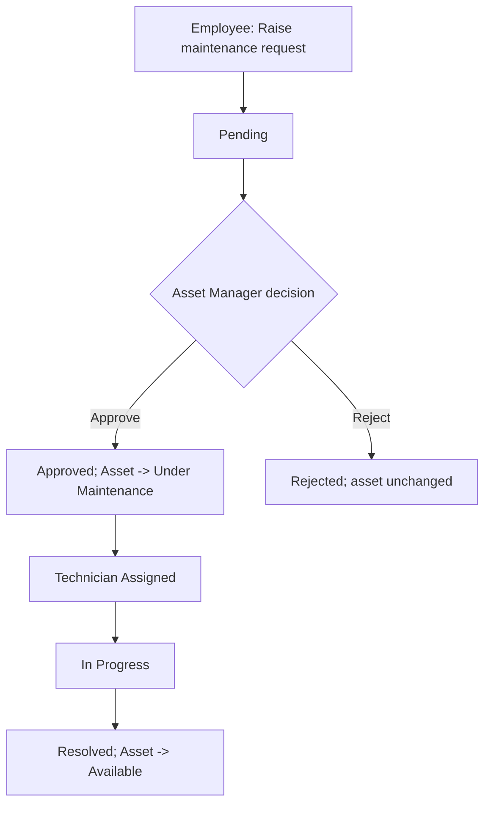
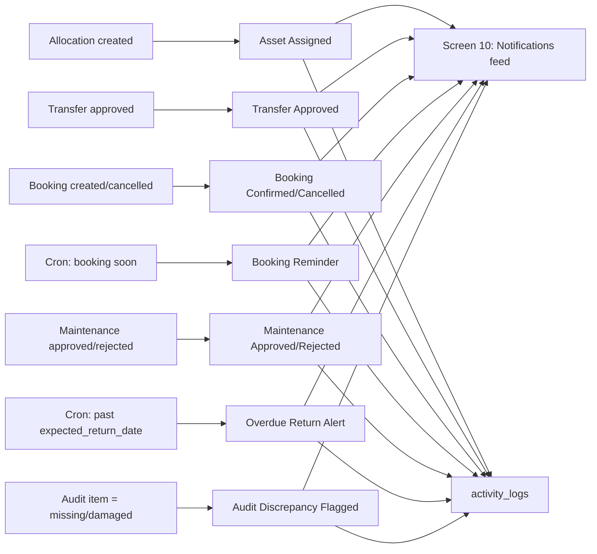
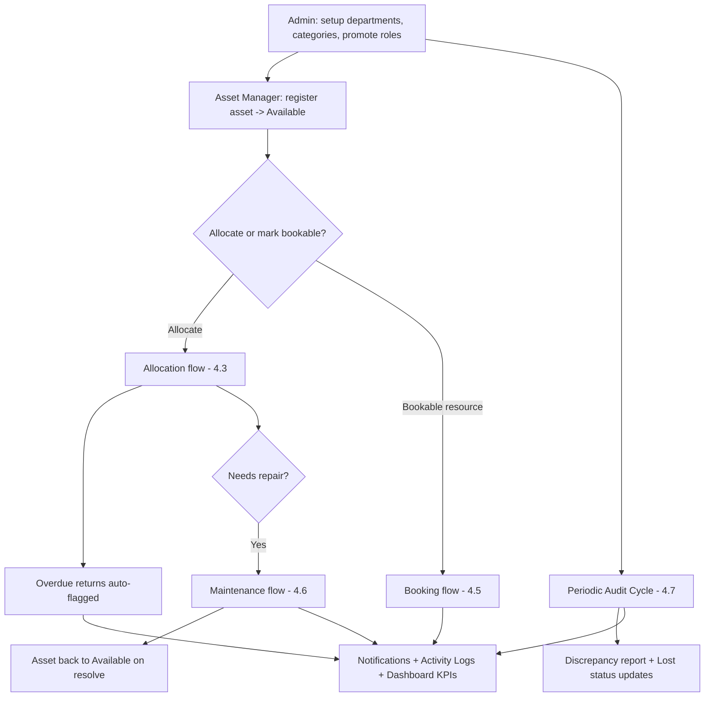

# AssetFlow — Web Flow

Version 1.0 | Maps every screen, component, and navigation path from the problem statement + mockup.

## 1. Global Shell
Persistent left sidebar (Screens 2–10), same order everywhere:
`Dashboard | Organization Setup* | Assets | Allocation & Transfer | Resource Booking | Maintenance | Audit | Reports | Notifications`
`*Organization Setup` visible/enabled to **Admin only**; other roles see remaining items, scoped by RBAC (see PRD §5, TRD §6).

Top-level unauthenticated route: **Screen 1 (Login/Signup)**. All other screens require a valid session; expired/invalid session → redirect to Screen 1.

## 2. Screen Inventory (component-level)

### Screen 1 — Login / Signup
- Email field, Password field, "Forgot password" link
- "Create Account" (signup) → creates **Employee** account only, no role picker ("admin roles assigned later")
- On success → Screen 2 (Dashboard)

### Screen 2 — Dashboard
- KPI cards: Available, Allocated, Active Bookings, Pending Transfers, Upcoming Returns
- Overdue banner: "N assets overdue for return – flagged for follow-up" (distinct styling, red)
- Quick actions: `+ Register Asset` → Screen 4, `Book Resource` → Screen 6, `Raise Requests` → Screen 7
- Recent Activity feed (latest events, same data source as Screen 10)

### Screen 3 — Organization Setup (Admin only)
- Tabs: Departments / Categories / Employee, `+ Add`
- Departments table: Head, Parent Dept, Status (Active/Inactive)
- Note: edits here drive picklists on Screen 4 (category/dept filters) and Screen 5 (allocation dept picker)
- Employee tab is the **only** place roles are promoted (Employee → Dept Head / Asset Manager)

### Screen 4 — Asset Registration & Directory
- Search bar (tag / serial / QR code) + `+ Register Asset`
- Filters: Category, Status, Department
- Table: Tag, Name, Category, Status, Location
- Row click → asset detail (history: allocation + maintenance)

### Screen 5 — Asset Allocation & Transfer
- Asset selector
- **Block state**: red banner "Already Allocated to {holder} ({dept}) – Direct re-allocation is blocked – submit a transfer request below"
- Transfer Request form: From (current holder, read-only) / To (employee picker) / Reason / `Submit Request`
- Allocation history log (chronological, allocate/return entries)

### Screen 6 — Resource Booking
- Resource + date selector
- Time-slot calendar (hourly rows)
- Existing booking shown solid (e.g. "Booked – Procurement Team – 9 to 10")
- Conflicting request shown dashed/red: "Requested 9:30 to 10:30 – conflict – slot is unavailable"
- `Book a Slot` (only enabled for non-overlapping ranges)

### Screen 7 — Maintenance Management
- Kanban board, columns = workflow states: **Pending → Approved → Technician Assigned → In Progress → Resolved**
- Each card: asset tag, issue summary, technician (once assigned)
- Footnote: "Approving a card moves the asset to Under Maintenance, resolving returns it to Available"

### Screen 8 — Asset Audit
- Cycle banner: scope (dept/date range), assigned auditors
- Checklist table: Asset, Expected Location, Verification (Verified / Missing / Damaged — tri-state selector)
- Flag banner: "N assets flagged – discrepancy report generated automatically"
- `Close Audit Cycle` (locks cycle, bulk-updates flagged-missing assets to Lost)

### Screen 9 — Reports & Analytics
- Charts: Utilization by department (bar), Maintenance Frequency (line)
- Lists: Most Used Assets, Idle Assets, Assets Due for Maintenance / Nearing Retirement
- `Export Report`

### Screen 10 — Activity Logs & Notifications
- Filter tabs: All / Alerts / Approvals / Bookings
- Feed rows: message + relative timestamp (e.g. "Overdue return: AF-0021 was due 3 days ago – 1d ago")

## 3. Navigation Map



## 4. Key User Flows

### 4.1 Signup / Login


### 4.2 Role Promotion (Admin path)


### 4.3 Asset Registration → Allocation


### 4.4 Return Flow


### 4.5 Resource Booking


### 4.6 Maintenance Workflow


### 4.7 Audit Cycle
```mermaid
flowchart TD
  A[Admin/Asset Mgr: create Audit Cycle] --> B[Set scope: dept/location + date range]
  B --> C[Assign auditor(s)]
  C --> D[Auditors verify each in-scope asset]
  D --> E{Verification}
  E -->|Verified| F[No action]
  E -->|Missing or Damaged| G[Flagged for discrepancy report]
  G --> H[Report auto-generated]
  H --> I[Close Audit Cycle]
  I --> J[Cycle locked; confirmed-missing assets -> Lost]
```

### 4.8 Notifications Trigger Map


## 5. End-to-End Organizational Flow (matches problem statement "Basic Workflow")


## 6. Role-Scoped Navigation Differences
| Screen | Admin | Asset Manager | Dept Head | Employee |
|---|---|---|---|---|
| Dashboard | full org KPIs | full org KPIs | dept-scoped KPIs | own-item KPIs |
| Org Setup | full access | ❌ hidden | ❌ hidden | ❌ hidden |
| Assets | full | register/edit | view dept assets | view own/dept assets |
| Allocation & Transfer | full | allocate + approve transfer | approve dept transfers | request transfer/return only |
| Resource Booking | full | full | full | book/cancel own |
| Maintenance | full | approve/assign | raise + view dept | raise + view own |
| Audit | create/close cycles | create/close cycles, verify if assigned | view if in scope | verify only if assigned as auditor |
| Reports | org-wide | org-wide | dept-scoped | own-only (limited) |
| Notifications | all org events | all org events | dept-scoped | own-scoped |

## 7. References
- Architecture: `AssetFlow_Architecture.md`
- Product requirements: `AssetFlow_PRD.md`
- Technical requirements: `AssetFlow_TRD.md`
- Schema: `AssetFlow_Schema.md`
